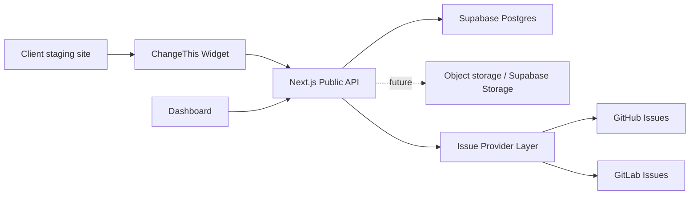

# Architecture

Etat actuel: voir [current-state.fr.md](current-state.fr.md). Ce document décrit l'architecture active au 2026-05-02, pas une cible abstraite.

## Stack

- Next.js App Router for the dashboard and API
- TypeScript across all packages
- npm workspaces for the monorepo
- Supabase Auth for production beta authentication (`AUTH_MODE=supabase`)
- Supabase REST/Postgres for the real beta store (`DATA_STORE=supabase`)
- Local file store only for development (`DATA_STORE=file`)
- Railway for app hosting in the beta path
- OVH DNS for `app.changethis.dev`
- GitHub and GitLab issue providers for manual issue creation from the inbox
- Public widget bundle served by the app through `/widget.js` and `/widget.global.js`

## Data Flow

## Security Baseline

- The browser widget only receives a public project key.
- Issue provider tokens never enter the browser.
- API validates the request origin against project allowlists.
- Screenshot uploads are size limited but still stored as data URLs in the current beta path; object storage with signed URLs is a known follow-up.
- Form fields and sensitive elements should be masked before capture.
- GitHub and GitLab webhooks must be verified before processing.
- Supabase RLS should protect all private project data.
- `/api/ready` checks auth, data store, service role, required secrets, and expected Supabase tables.
- `DATA_STORE=file` and `AUTH_MODE=local` are no-go values in production beta.
