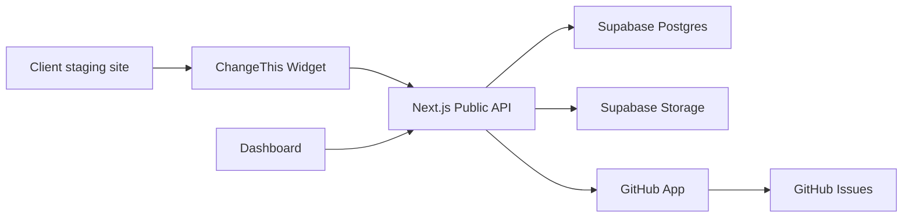

# Architecture

## Stack

- Next.js App Router for the dashboard and API
- TypeScript across all packages
- npm workspaces for the monorepo
- Supabase planned for Postgres, auth, storage, and RLS
- GitHub App planned for issue creation
- Vercel planned for hosting

## Data Flow

## Security Baseline

- The browser widget only receives a public project key.
- GitHub tokens never enter the browser.
- API validates the request origin against project allowlists.
- Screenshot uploads are size limited.
- Form fields and sensitive elements should be masked before capture.
- GitHub webhooks must be signature verified.
- Supabase RLS should protect all private project data.
