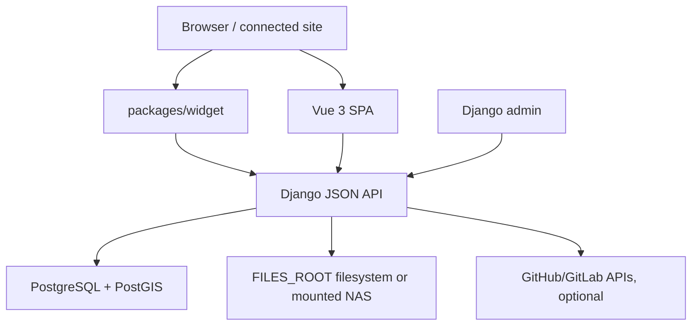

# Architecture CRAW

`CRAW` targets a conventional self-hosted deployment operated on CRA-W infrastructure.

```mermaid
flowchart TD
  Browser["Browser / connected site"] --> Widget["packages/widget"]
  Browser --> Spa["Vue 3 SPA"]
  Widget --> Api["Django JSON API"]
  Spa --> Api
  Api --> Db["PostgreSQL + PostGIS"]
  Api --> Files["FILES_ROOT filesystem or mounted NAS"]
  Api --> Providers["GitHub/GitLab APIs, optional"]
  Admin["Django admin"] --> Api
```

## Components

- `apps/frontend`: Vue 3, Vite, TypeScript, Pinia and Vue Router.
- `apps/backend`: Django sessions, API, admin, migrations, storage and synchronous jobs.
- `packages/widget`: public browser widget served by Django.
- `packages/shared`: TypeScript protocol shared by frontend/widget code.
- PostgreSQL/PostGIS: single source of truth through Django migrations.
- Filesystem: screenshots and generated files under `FILES_ROOT`.

## Runtime

Docker Compose starts `frontend`, `backend` and `postgres`. In production, a CRA-W reverse proxy can point users to Django directly; Django serves the built SPA and widget bundles.

## Security Baseline

- Session cookies are HTTP-only and same-site.
- Public feedback writes require a known project public key.
- Provider tokens are optional and should be replaced by a stronger secret storage mechanism before sensitive production use.
- Screenshots are stored as files; the database stores only relative paths and metadata.
